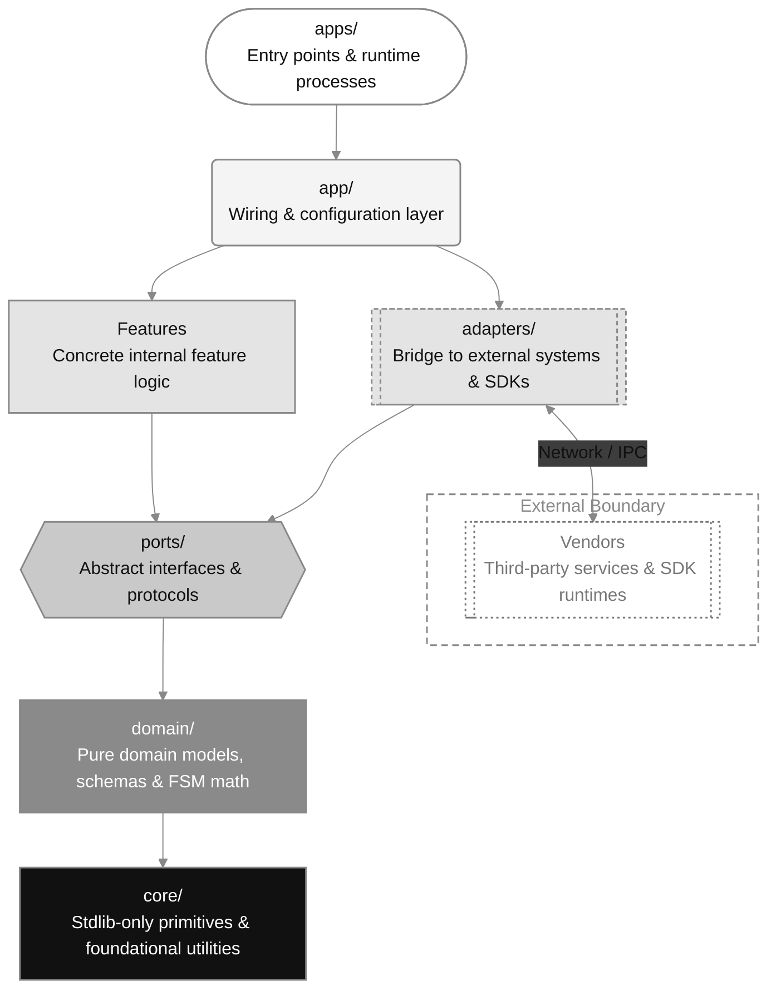

```mermaid
%%{init: {'theme':'base','themeVariables':{
    'lineColor':'#888888',
    'textColor':'#888888',
    'titleColor':'#888888',
    'edgeLabelBackground':'#3e3d3d',
    'clusterBkg':'transparent',
    'clusterBorder':'#888888'
}}}%%
flowchart TB

    classDef apps     fill:#ffffff,stroke:#888888,stroke-width:1.5px,color:#111111
    classDef root     fill:#f4f4f4,stroke:#888888,stroke-width:1.5px,color:#111111
    classDef features fill:#e4e4e4,stroke:#888888,stroke-width:1.5px,color:#111111
    classDef adapters fill:#e4e4e4,stroke:#888888,stroke-width:1.5px,stroke-dasharray:4 3,color:#111111
    classDef ports    fill:#c9c9c9,stroke:#888888,stroke-width:1.5px,color:#111111
    classDef domain   fill:#8a8a8a,stroke:#888888,stroke-width:1.5px,color:#ffffff
    classDef core     fill:#111111,stroke:#888888,stroke-width:1.5px,color:#ffffff
    classDef vendors  fill:none,stroke:#777777,stroke-width:1.5px,stroke-dasharray:2 3,color:#777777

    Applications(["apps/<br>Entry points & runtime processes"]):::apps
    CompositionRoot("app/<br>Wiring & configuration layer"):::root
    Features["Features<br>Concrete internal feature logic"]:::features
    Adapters[["adapters/<br>Bridge to external systems & SDKs"]]:::adapters
    Ports{{"ports/<br>Abstract interfaces & protocols"}}:::ports
    Domain["domain/<br>Pure domain models, schemas & FSM math"]:::domain
    Core["core/<br>Stdlib-only primitives & foundational utilities"]:::core

    subgraph External ["External Boundary"]
        Vendors[["Vendors<br>Third-party services & SDK runtimes"]]:::vendors
    end
    style External fill:none,stroke:#888888,stroke-width:1.5px,stroke-dasharray:6 4,color:#888888

    Applications --> CompositionRoot
    CompositionRoot --> Features
    CompositionRoot --> Adapters
    Features --> Ports
    Adapters --> Ports
    Ports --> Domain
    Domain --> Core
    Adapters <-->|Network / IPC| Vendors
```